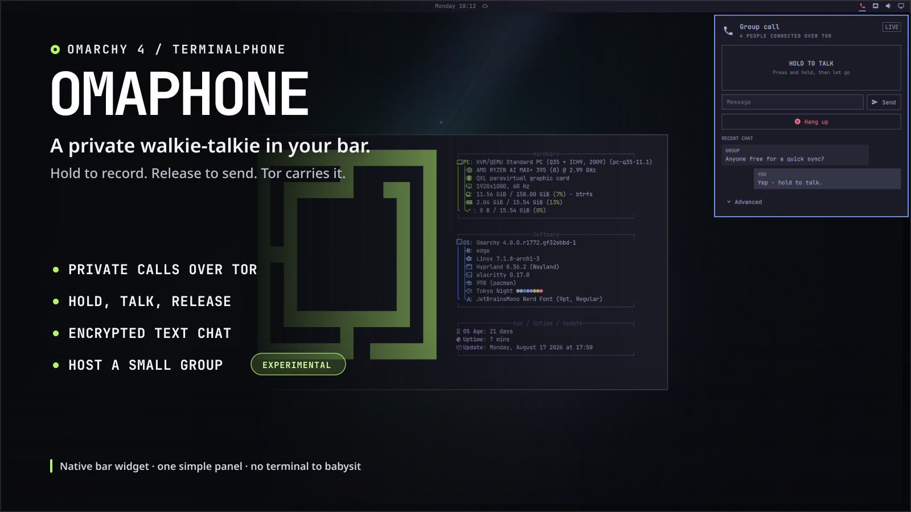

# Omaphone



**A private walkie-talkie in your Omarchy bar. Hold to record. Release to
send. Tor carries it.**

Omaphone turns
[TerminalPhone](https://github.com/edengilbertus/terminalphone) into a small,
native Omarchy 4 widget. Open it from the bar, call a friend, hold the big talk
button, and let go when you are done. You can also send text messages or host
an experimental group room.

It feels like a call, but the audio is intentionally not live. Omaphone records
one short voice message while you hold the button, then encrypts and sends it
when you release. That simple rhythm works well over Tor and makes taking turns
feel natural.

## What you get

- Private, direct voice calls carried through Tor onion services.
- One big hold-to-record button, with clear local and remote activity.
- Encrypted text chat alongside every call.
- Simple private contact cards: share yours, or add one from someone you trust.
- An experimental group-room host for small push-to-talk conversations.
- First-run setup, audio testing, call quality, voice effects, and chimes.
- Optional connection and authentication controls tucked into **Advanced**.
- A theme-aware Omarchy panel with keyboard navigation and no terminal window
  to manage.

Underneath the friendly panel, Omaphone runs one pinned copy of TerminalPhone.
TerminalPhone still owns the Tor connection, audio, encryption, and wire
protocol; Omaphone handles setup, lifecycle, safe state, and the desktop
experience. See [Architecture](docs/ARCHITECTURE.md) for the full design.

## Install

From a committed checkout of this repository:

```bash
omarchy plugin validate .
omarchy plugin add "$PWD" --enable --yes
```

Or install the published repository directly:

```bash
omarchy plugin add https://github.com/tomdavenport/omaphone.git --enable --yes
```

Omarchy clones the plugin into
`~/.config/omarchy/plugins/omaphone.phone` and adds the phone to the right side
of the bar.

Open the phone and choose **Set up Omaphone**. If it says a few tools are
missing, choose **Install missing tools**. After that, the two first-call
buttons handle the Tor setup for you. Creating a private route can take a
minute or two the first time.

Update an installed copy with:

```bash
omarchy-shell omaphone.phone offline
omarchy plugin update omaphone.phone --yes
```

The `--yes` flag skips the long change preview in the terminal. Without it,
press `q` when you have finished reading that preview; the update is waiting,
not stuck. Omarchy validates the update and reloads the plugin automatically.

Very early local-checkout installs made before the public repository may not
share its Git history. If Omarchy refuses that one update even though the
checkout is clean, remove it with the command below and run the published
install command again; Omaphone's private state is kept.

To remove Omaphone cleanly:

```bash
omarchy-shell omaphone.phone offline
omarchy plugin remove omaphone.phone
```

Going offline first stops the background listener. Removing the plugin leaves
your private address, room key, settings, and local messages in your standard
per-user data folders, so reinstalling does not unexpectedly give you a new
identity.

## Make your first private call

Decide which computer will wait and which will connect:

1. **Receiver:** choose **Share my phone**, send the copied private contact
   card through a trusted channel, and leave Omaphone waiting.
2. **Caller:** choose **Add a phone**, paste the private contact card, then
   choose **Add & connect**.

That is the whole connection flow. You do not need to copy an onion address,
go online separately, or press a second Call button. Omaphone prepares Tor,
remembers the paired phone, and starts the call.

There is no telephone-style ringing or separate answer phase in the underlying
TerminalPhone protocol. The receiver waits while the caller opens the route;
both sides move to the conversation when it is ready. Do not wait for a ring
or an Answer button. Sounds are connection and push-to-talk feedback, not a
ringtone.

Once connected, hold the talk button to record and release it to send. Type
below it when text is easier, then choose **Hang up** when you are finished.
Next time, the receiver can wait again and the caller can choose **Call paired
phone**.

The private contact card contains both the receiver's address and the key to
the conversation; it does not expire after use. Anyone who gets it can attempt
to call and decrypt compatible traffic, so treat it like a password: do not
post it in public, and remove it from clipboard history when that matters. You
can delete the small local text history from **Advanced**.

Under the current TerminalPhone backend, this installation has one stable
`.onion` device address and one global direct-call secret. A private contact
card does not create a different number or cryptographic key for each person.
The connecting side saves one **Paired phone**. Adding a different card
replaces that saved phone and the active global secret, so the earlier card
must be added again before that conversation will work. A proper multi-contact
design needs separate, invisible per-contact keys; it is not something 1.2
pretends to provide.

The normal guided flow deliberately hides raw `.onion` addresses. Manual
address calling remains under **Advanced** for troubleshooting and
TerminalPhone interoperability.

## Host a group room (experimental)

TerminalPhone includes an experimental multi-caller relay, and Omaphone makes
it available as **Host a group on this computer**. The host can be an ordinary
local machine. You do not need a public server, a public IP address, or router
port forwarding: Tor publishes the room as an onion service.

The trade-off is that the host machine must stay awake, online, and running the
room. That Omaphone instance becomes a relay only; it cannot talk or chat in
the room. Join from another machine if the host also wants to take part.

Each time you host, Omaphone makes a fresh room key in memory. It does not
replace or share the host's regular call key, and Omaphone does not save it to
disk. Participants save the room key as their current call key when they use
the invite, so they should still treat it like a password. A clipboard manager
may retain a copied room invite after the room stops.

To join a room, choose **Add a phone**, paste the host's room invite, then
choose **Add & connect**. There is no separate online or call step; the relay
identifies the connection as a group call. Although it uses the same private
code field, a room invite is a shared room capability, not a phone contact.

A room invite uses the same one-pair slot as a direct call. Joining a room
therefore replaces the paired phone and call key remembered on that device.
After the room, add the direct phone's private contact card again to restore
that pairing.

To host a room:

1. Under **Small group · Experimental**, choose **Host a group on this
   computer** and confirm.
2. Wait for **Room is ready**, then choose **Copy room invite**.
3. Send that same invite to every participant through a trusted private
   channel.
4. Keep the host awake. Everyone else follows the joining step above.

Take turns speaking. This is push-to-talk forwarding, not a live audio mix.

Keep rooms small and have one person speak at a time. The upstream design can
accept multiple callers, but Omaphone labels the feature experimental because
it does not set a tested capacity or provide moderation, admission controls,
or speaking queues.

There is one important hosting caveat in the currently pinned TerminalPhone:
its `socat` listener does not explicitly bind to loopback, so the listening
port may also be reachable on the host's LAN interfaces. No router forwarding
is needed, but the host should use a firewall to block non-loopback access to
that port. The default is TCP `7777`. Read the room's metadata and trust limits
in [Security](docs/SECURITY.md#group-room-hosting) before inviting people.

## Requirements

- Omarchy 4.x with the `omarchy-shell`/Quickshell bar.
- Python 3, used only by Omaphone's local supervisor.
- TerminalPhone's Arch packages: `tor`, `opus-tools`, `sox`, `socat`,
  `openssl`, `alsa-utils`, and `libpulse`.
- The AUR package `snowflake-pt-client-bin` only if you turn on the optional
  Snowflake connection method.

**Install missing tools** uses PolicyKit for package-manager approval. It
does not store or bypass an administrator password. Normal Tor calls and group
rooms do not need Snowflake. It is only an alternative way to reach Tor on a
network that blocks it.

Omaphone does not silently build optional AUR software. If you need Snowflake,
review the AUR package and its build instructions, then install the compatible
package yourself:

```bash
omarchy pkg aur add snowflake-pt-client-bin
```

The `-bin` package matters: it provides the `snowflake-client` command that
TerminalPhone expects. If Snowflake was already turned on but that command is
missing, choose **Use normal Tor** in Omaphone. You can also recover from a
terminal without changing your private address, call key, or messages:

```bash
omarchy-shell omaphone.phone setConfig snowflake false
```

## Privacy, in plain English

Omaphone hides networking and cryptography controls; it does not make their
trade-offs disappear. Your current call key is kept in a user-only file so
Omaphone can listen in the background without asking for a passphrase after
every restart. A hosted room uses a separate, short-lived key in the host
process; participants save it when they use the room invite. Recent text
messages are also local plaintext with user-only permissions. Disk encryption
and a locked session still matter.

TerminalPhone has not been independently audited as part of this project.
Omaphone preserves its implementation instead of inventing a second
cryptographic protocol. Read [Security](docs/SECURITY.md) before relying on it
for a high-risk conversation.

Omaphone does not ship an address book yet. The planned model keeps one stable
device number, adds local names, and gives each relationship its own invisible
cryptographic key. The legacy backend cannot get there by sharing its one
global key with a list of names. See the [Contacts roadmap](docs/CONTACTS.md).

The larger product direction—People, Private Drops, video Postcards, a
self-hosted answering machine, and the honest boundary around live video—is in
the [communications roadmap](docs/ROADMAP.md).

## Command-line controls

The widget exposes the Omarchy Shell target `omaphone.phone`:

```bash
omarchy-shell omaphone.phone open
omarchy-shell omaphone.phone status
omarchy-shell omaphone.phone online
omarchy-shell omaphone.phone offline
omarchy-shell omaphone.phone hangup
```

## Development

The Omaphone supervisor has no third-party Python dependencies. Run the
non-desktop checks with:

```bash
python3 -m unittest discover -s tests -v
python3 -m py_compile scripts/*.py
omarchy plugin validate .
```

These checks do not need Tor, a microphone, root access, a compositor, or
control of the host desktop.

Omaphone is MIT licensed. TerminalPhone's separate license, pinned revision,
and checksum are recorded in
[Third-party notices](THIRD_PARTY_NOTICES.md).
